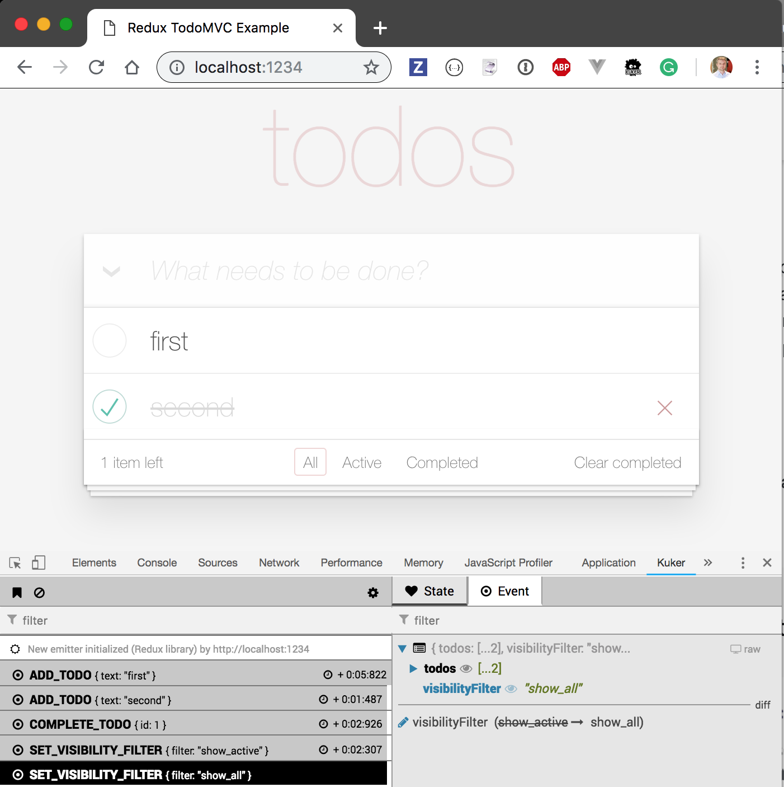
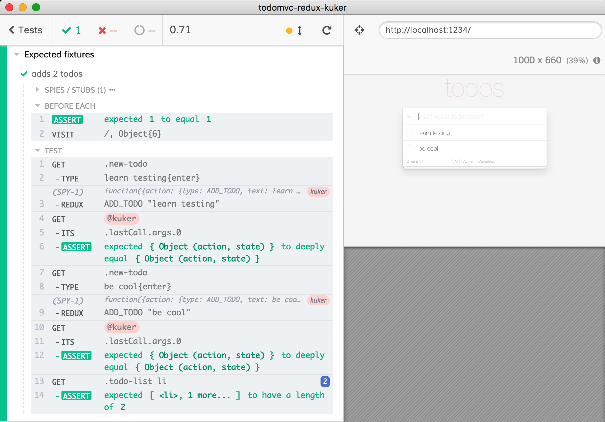

# todomvc-redux-kuker [![renovate-app badge][renovate-badge]][renovate-app]

Example application has been forked from [reduxjs/redux](https://github.com/reduxjs/redux/tree/master/examples/todomvc) and stored in `src` folder.

## Run

```shell
npm install
npm run dev
```

Start the application and opens Cypress test runner with several specs. You can also open the Chrome browser at [localhost:1234](http://localhost:1234), and if you have [Kuker Extension][kuker-extension] installed, you should see Redux events reported as you use the application.



## Specs

Different specs in [cypress/integration](cypress/integration) folder show different levels of processing Kuker events in the Cypress tests

- [spec.js](cypress/integration/spec.js) is purely UI test without any Kuker events
- [spy-spec.js](cypress/integration/spy-spec.js) shows how to spy from the test on `window.postMessage` calls used by Kuker emitter to send data to the Kuker DevTools extension
- [kuker-spec.js](cypress/integration/kuker-spec.js) makes a separate spy that only sees clean event data and nicely logs event details
- [fixture-spec.js](cypress/integration/fixture-spec.js) asserts data sent by Kuker against expected values loaded from [cypress/fixtures](cypress/fixtures) JSON files



## Tools

- [Cypress.io](https://www.cypress.io)
- [kuker](https://github.com/krasimir/kuker)
- [Kuker DevTools extension][kuker-extension]

[kuker-extension]: https://chrome.google.com/webstore/detail/kuker/glgnienmpgmfpkigngkmieconbnkmlcn

[renovate-badge]: https://img.shields.io/badge/renovate-app-blue.svg
[renovate-app]: https://renovateapp.com/
